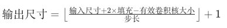

## **1、卷积操作原理**

卷积操作是深度学习（尤其是计算机视觉）中的核心概念，它通过滑动滤波器（卷积核）在输入数据上进行局部计算，提取特征。以下从原理、数学表达、计算过程到实际应用进行详细解释。

### **1. 基本概念**
#### **1.1 核心思想**
- **局部感知**：卷积核（Kernel/Filter）在输入数据（如图像）上滑动，每次只关注局部区域。
- **权重共享**：同一个卷积核在整个输入上重复使用，减少参数数量。

#### **1.2 直观理解**
- **图像滤波**：类似于Photoshop中的滤镜（如边缘检测、模糊），卷积核能提取特定特征（如边缘、纹理）。
- **数学本质**：离散卷积运算，将卷积核与输入区域逐元素相乘后求和。


### **2. 数学原理**
#### **2.1 一维卷积**
对于一维信号 $x[n]$ 和卷积核 $w[k]$，卷积结果 $y[n]$ 为：
$$
y[n] = (x * w)[n] = \sum_{k=-\infty}^{\infty} x[k] \cdot w[n - k]
$$
- **实际计算**：卷积核翻转后与输入信号滑动相乘求和（深度学习中通常不翻转，实际为**互相关运算**）。

#### **2.2 二维卷积（图像卷积）**
对于二维图像 $X[i,j]$ 和卷积核 $W[k,l]$，输出 $Y[i,j]$ 为：
$$
Y[i,j] = \sum_{k=1}^{K} \sum_{l=1}^{L} X[i+k, j+l] \cdot W[k, l]
$$
- **K×L**：卷积核大小。
- **步长（Stride）**：卷积核每次滑动的距离。
- **填充（Padding）**：在输入周围添加零值，控制输出尺寸。


### **3. 计算过程示例**
#### **3.1 输入与卷积核**
- **输入**：5×5 图像（简化为整数）
  ```
  [[1, 2, 0, 3, 1],
   [0, 1, 2, 3, 1],
   [1, 2, 1, 0, 0],
   [3, 1, 0, 2, 1],
   [2, 1, 0, 1, 1]]
  ```
- **卷积核**：3×3 矩阵
  ```
  [[1, 0, 1],
   [0, 1, 0],
   [1, 0, 1]]
  ```

#### **3.2 滑动计算**
1. **第一步**：卷积核与左上角3×3 区域相乘：
   ```
   输入区域:      卷积核:        乘积:
   [[1, 2, 0],    [[1, 0, 1],    [[1, 0, 0],
    [0, 1, 2],     [0, 1, 0],     [0, 1, 0],
    [1, 2, 1]]     [1, 0, 1]]     [1, 0, 1]]
   输出值 = 1+0+0+0+1+0+1+0+1 = 4
   ```
2. **滑动卷积核**：向右移动一步（步长=1），重复计算。
3. **最终输出**：3×3 特征图（假设无填充）。


### **4. 关键参数**
#### **4.1 卷积核大小（Kernel Size）**
- 常见尺寸：1×1、3×3、5×5。
- 小卷积核（如3×3）需多层堆叠以增加感受野。

#### **4.2 步长（Stride）**
- 控制卷积核每次滑动的距离。
- 步长>1 会减小输出尺寸（如 stride=2 使输出尺寸减半）。

#### **4.3 填充（Padding）**
- **Valid Padding**：无填充，输出尺寸缩小。
- **Same Padding**：填充使输出尺寸与输入相同（通常用零填充）。

#### **4.4 输出通道数（Filters）**
- 每个卷积核提取一种特征。
- 增加通道数可提取更多类型的特征（如同时检测水平和垂直边缘）。

#### **4.5 输出大小**
- 

### **5. 多通道与批量计算**
#### **5.1 多通道输入（如图像RGB）**
- 每个通道有独立的卷积核。
- 输出为所有通道卷积结果的求和。

#### **5.2 批量计算**
- 同时处理多个输入样本（如 mini-batch）。
- 每个样本独立计算，共享同一组卷积核。


### **6. 卷积操作的优势**
1. **参数效率**：权重共享减少参数数量，降低过拟合风险。
2. **平移不变性**：无论特征出现在图像何处，都能被检测到。
3. **分层特征提取**：多层卷积可从低级特征（边缘）逐步提取高级特征（物体）。


### **7. 应用场景**
- **计算机视觉**：图像分类、目标检测、语义分割。
- **自然语言处理**：文本分类、机器翻译（结合注意力机制）。
- **语音识别**：音频特征提取。


### **8. 代码示例（PyTorch）**
```python
import torch
import torch.nn as nn

# 创建卷积层（输入通道3，输出通道16，卷积核3×3，填充1）
conv = nn.Conv2d(in_channels=3,    # 输入通道数（如RGB图像为3）
                 out_channels=16,  # 输出通道数（卷积核数量）
                 kernel_size=3,    # 卷积核大小
                 stride=1,         # 步长
                 padding=1)        # 填充

# 输入：批量大小=1，通道=3，高度=32，宽度=32
x = torch.randn(1, 3, 32, 32)
output = conv(x)  # 输出形状：[1, 16, 32, 32]
print(output.shape)
```


### **总结**
卷积操作通过局部连接和权重共享，高效提取数据特征，是深度学习的核心组件。理解卷积的原理（滑动窗口、参数共享、多通道计算）对于设计和优化神经网络至关重要。


## **2、卷积核分类**
在深度学习中，卷积核（Filter/Kernel）是实现卷积操作的核心组件，其设计直接影响模型提取特征的能力。根据不同的应用场景和设计目标，卷积核可分为多种类型。以下是常见的卷积核类型及其特点：


### **一、按功能分类**
#### 1. **边缘检测核**
- **作用**：提取图像中的边缘信息。
- **常见类型**：
  - **Sobel算子**（3×3）：  
    ```
    水平边缘：[[-1, 0, 1],       垂直边缘：[[-1, -2, -1],
              [-2, 0, 2],                  [0,  0,  0],
              [-1, 0, 1]]                  [1,  2,  1]]
    ```
  - **Prewitt算子**（3×3）：  
    ```
    水平边缘：[[-1, 0, 1],       垂直边缘：[[-1, -1, -1],
              [-1, 0, 1],                  [0,  0,  0],
              [-1, 0, 1]]                  [1,  1,  1]]
    ```
  - **Laplacian算子**（各向同性边缘）：  
    ```
    [[ 0, -1,  0],
     [-1,  4, -1],
     [ 0, -1,  0]]
    ```

#### 2. **模糊/平滑核**
- **作用**：减少图像噪声，平滑图像。
- **常见类型**：
  - **均值滤波**（3×3）：  
    ```
    [[1/9, 1/9, 1/9],
     [1/9, 1/9, 1/9],
     [1/9, 1/9, 1/9]]
    ```
  - **高斯滤波**（3×3，σ=1）：  
    ```
    [[1/16, 2/16, 1/16],
     [2/16, 4/16, 2/16],
     [1/16, 2/16, 1/16]]
    ```

#### 3. **锐化核**
- **作用**：增强图像边缘和细节。
- **示例**：  
  ```
  [[ 0, -1,  0],
   [-1,  5, -1],
   [ 0, -1,  0]]
  ```


### **二、按结构分类**
#### 1. **标准卷积核**
- **特点**：全连接的矩形核（如3×3、5×5）。
- **参数数量**：$C_{in} \times C_{out} \times K \times K$。
- **应用**：广泛用于各类卷积神经网络（如AlexNet、VGG）。

#### 2. **深度可分离卷积（Depthwise Separable Conv）**
- **结构**：  
  1. **逐通道卷积**（Depthwise Conv）：每个输入通道对应一个独立的卷积核。  
  2. **逐点卷积**（Pointwise Conv）：1×1卷积调整通道数。  
- **优势**：参数量仅为标准卷积的$\frac{1}{K^2 + 1}$，计算效率高。  
- **应用**：MobileNet、ShuffleNet等轻量级模型。

#### 3. **空洞卷积（Dilated Conv）**
- **特点**：在标准卷积核中插入空格，增大感受野。  
- **参数**：空洞率（Dilation Rate）$d$。  
- **示例**：3×3卷积核，$d=2$时的有效感受野为5×5：  
  ```
  标准：[[X, X, X],    空洞：[[X, 0, X],
         [X, X, X],           [0, 0, 0],
         [X, X, X]]           [X, 0, X]]
  ```
- **应用**：语义分割（如DeepLab）、音频处理。

#### 4. **分组卷积（Grouped Conv）**
- **特点**：将输入通道分为多组，每组独立卷积。  
- **参数**：分组数$G$。  
- **应用**：ResNeXt、GoogleNet的Inception模块。

#### 5. **1×1卷积（Pointwise Conv）**
- **作用**：调整通道数，实现跨通道信息融合。  
- **优势**：参数量极少，计算高效。  
- **应用**：ResNet的残差块、GoogleNet。


### **三、按学习方式分类**
#### 1. **预定义卷积核**
- **特点**：手动设计，参数固定（如Sobel、高斯核）。  
- **应用**：传统图像处理，或作为深度学习的初始化。

#### 2. **可学习卷积核**
- **特点**：参数在训练过程中通过反向传播自动学习。  
- **应用**：现代卷积神经网络（如CNN、Transformer中的卷积变体）。


### **四、特殊设计的卷积核**
#### 1. **可变形卷积（Deformable Conv）**
- **特点**：在标准卷积的基础上增加偏移量，自适应调整感受野形状。  
- **应用**：目标检测（如Detectron2）、实例分割。

#### 2. **注意力卷积（Attention-based Conv）**
- **特点**：根据输入内容动态调整卷积核权重。  
- **示例**：Squeeze-and-Excitation（SE）模块、CBAM注意力机制。

#### 3. **混合卷积（MixConv）**
- **特点**：在同一层中使用多种不同大小的卷积核，捕获多尺度特征。  
- **应用**：EfficientNet。


### **五、不同领域的典型卷积核**
| **领域** | **典型卷积核**           | **作用**        |
|--------|---------------------|---------------|
| 图像分类   | 标准卷积、1×1卷积          | 提取全局特征        |
| 目标检测   | 可变形卷积、分组卷积          | 适应不同形状和尺度的物体  |
| 语义分割   | 空洞卷积、深度可分离卷积        | 增大感受野，平衡精度和速度 |
| 超分辨率   | 亚像素卷积（PixelShuffle） | 上采样恢复图像细节     |
| 音频处理   | 一维卷积、扩张卷积           | 捕获时序特征和长距离依赖  |


### **六、总结**
卷积核的设计从早期的手工设计（如边缘检测核）发展到如今的自动学习（如可变形卷积），其核心目标始终是更高效地提取数据中的关键特征。不同类型的卷积核通过优化参数效率、增大感受野、引入自适应机制等方式，推动了深度学习在各领域的应用突破。理解各类卷积核的特点和适用场景，有助于针对性地设计更高效的神经网络架构。